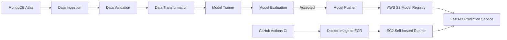

# Vehicle Insurance MLOps Pipeline

<p align="center">
  <strong>Production-oriented machine learning system for vehicle insurance response prediction</strong><br/>
  Built with FastAPI, MongoDB Atlas, Scikit-learn, AWS S3, Docker, and GitHub Actions.
</p>

<p align="center">
  
  
  
  
  
  
</p>

## Project Snapshot

This repository demonstrates a complete MLOps workflow around a binary classification use case:

- Problem: Predict whether a customer is likely to respond to a vehicle insurance offer.
- Data source: MongoDB Atlas collection.
- Training pipeline: Data ingestion, validation, transformation, model training, model evaluation, model registry push.
- Serving: FastAPI web app with HTML form and real-time prediction.
- Registry and deployment: AWS S3 model storage, Dockerized app, GitHub Actions CI/CD to EC2 self-hosted runner.

The project is designed to showcase practical ML engineering skills recruiters care about:

- Reproducible pipeline artifacts
- Config-driven architecture using dataclasses
- Custom exception and logging framework
- Cloud model lifecycle (S3 pull/push)
- Automated container delivery pipeline

## End-to-End Architecture



## Core Features

- Modular ML pipeline in src/pipline/training_pipeline.py
- Automated data quality checks against config/schema.yaml
- Feature engineering + scaling + class balancing (SMOTEENN)
- RandomForest model training with configurable hyperparameters
- F1-based champion/challenger model evaluation against production model from S3
- Model registry push to AWS S3 when candidate model is accepted
- FastAPI app for:
  - Triggering training via GET /train
  - Running inference via POST /
- Docker support for consistent runtime
- GitHub Actions workflow for CI/CD to AWS ECR + EC2

## Tech Stack

| Layer | Tools/Services |
|---|---|
| Language | Python 3.10 |
| API | FastAPI, Uvicorn, Jinja2 |
| ML | Scikit-learn, Imbalanced-learn, NumPy, Pandas |
| Data Source | MongoDB Atlas, PyMongo |
| Cloud | AWS S3 (model registry), ECR, EC2 |
| MLOps | GitHub Actions, Docker |
| Utilities | Dill, PyYAML, Certifi |

## Project Structure

```text
.
|- app.py                          # FastAPI app entrypoint
|- demo.py                         # Training pipeline trigger script
|- template.py                     # Project file scaffold generator
|- config/
|  |- schema.yaml                  # Validation + transformation schema
|  |- model.yaml                   # Model config placeholder
|- src/
|  |- components/                  # Ingestion/validation/transformation/trainer/evaluation/pusher
|  |- configuration/               # MongoDB and AWS connection clients
|  |- cloud_storage/               # S3 helper operations
|  |- data_access/                 # MongoDB export layer
|  |- entity/                      # Config and artifact dataclasses, estimators
|  |- pipline/                     # Training + prediction pipelines
|  |- utils/                       # YAML/object/numpy utility helpers
|  |- logger/                      # Rotating logger setup
|  |- exception/                   # Custom exception with trace details
|- templates/vehicledata.html      # Inference UI
|- static/css/style.css            # UI styling
|- .github/workflows/aws.yaml      # CI/CD workflow
|- Dockerfile
|- requirements.txt
```

## How the Training Pipeline Works

1. Data Ingestion
	- Pulls collection data from MongoDB Atlas
	- Saves feature store and train/test CSV files under artifact/<timestamp>/...

2. Data Validation
	- Compares expected schema columns and data types
	- Produces validation report at artifact/<timestamp>/data_validation/report.yaml

3. Data Transformation
	- Maps Gender values
	- One-hot encodes categorical features
	- Renames engineered columns to model-compatible names
	- Applies StandardScaler + MinMaxScaler
	- Handles imbalance with SMOTEENN
	- Saves transformed arrays and preprocessing object

4. Model Trainer
	- Trains RandomForestClassifier
	- Computes classification metrics (F1, precision, recall)
	- Saves wrapped model object (preprocessor + trained estimator)

5. Model Evaluation
	- Loads production model from S3 if available
	- Compares F1 scores (new model vs production model)
	- Accepts candidate model when performance is better

6. Model Pusher
	- Pushes accepted model artifact to S3 registry

## Local Setup and Run

### 1) Clone and enter project

```bash
git clone <your-repo-url>
cd MLOps-Pipeline-for-Vehicle-Insurance
```

### 2) Create environment (Python 3.10) and activate

```bash
conda create -n vehicle python=3.10 -y
conda activate vehicle
```

### 3) Install dependencies and local package

```bash
pip install -r requirements.txt
pip list
```

Note:
- setup.py and pyproject.toml are configured to install the local src package.
- requirements.txt includes -e ., so editable local package installation is handled during dependency install.

### 4) Generate template structure (if needed)

```bash
python template.py
```

### 5) Configure environment variables

Linux/macOS bash:

```bash
export MONGODB_URL="mongodb+srv://<username>:<password>@..."
export AWS_ACCESS_KEY_ID="<AWS_ACCESS_KEY_ID>"
export AWS_SECRET_ACCESS_KEY="<AWS_SECRET_ACCESS_KEY>"
```

Windows PowerShell:

```powershell
$env:MONGODB_URL="mongodb+srv://<username>:<password>@..."
$env:AWS_ACCESS_KEY_ID="<AWS_ACCESS_KEY_ID>"
$env:AWS_SECRET_ACCESS_KEY="<AWS_SECRET_ACCESS_KEY>"
```

### 6) Run training pipeline

```bash
python demo.py
```

### 7) Start API service

```bash
python app.py
```

App runs on:
- http://0.0.0.0:5000

Available routes:
- GET / : render input form
- POST / : predict response
- GET /train : trigger full training pipeline

## MongoDB Atlas Setup (Data Source)

1. Create a MongoDB Atlas project and cluster.
2. Add your current IP (or 0.0.0.0/0 for broad access during testing).
3. Create DB user credentials.
4. Use notebook/mongoDB_demo.ipynb to push dataset records into the target collection.
5. Ensure constants align with your DB/collection names:
	- DATABASE_NAME
	- COLLECTION_NAME
	- DATA_INGESTION_COLLECTION_NAME

## AWS Setup (Model Registry and Deployment)

Minimum services used:

- S3 bucket for model registry
- ECR repository for container image
- EC2 instance with Docker for hosting

Required runtime environment variables:

- AWS_ACCESS_KEY_ID
- AWS_SECRET_ACCESS_KEY
- MONGODB_URL

Model registry constants are defined in src/constants/__init__.py:

- MODEL_BUCKET_NAME
- MODEL_PUSHER_S3_KEY
- MODEL_EVALUATION_CHANGED_THRESHOLD_SCORE

## CI/CD Pipeline

Workflow file: .github/workflows/aws.yaml

Pipeline behavior:

1. On push to main:
	- Build Docker image
	- Push image to Amazon ECR
2. On self-hosted EC2 runner:
	- Pull latest image
	- Run container on port 5000 with required environment variables

GitHub repository secrets expected:

- AWS_ACCESS_KEY_ID
- AWS_SECRET_ACCESS_KEY
- AWS_DEFAULT_REGION
- ECR_REPO
- MONGODB_URL

## Docker Usage

Build image:

```bash
docker build -t vehicle-insurance-mlops .
```

Run container:

```bash
docker run -p 5000:5000 \
  -e MONGODB_URL="mongodb+srv://<username>:<password>@..." \
  -e AWS_ACCESS_KEY_ID="<AWS_ACCESS_KEY_ID>" \
  -e AWS_SECRET_ACCESS_KEY="<AWS_SECRET_ACCESS_KEY>" \
  vehicle-insurance-mlops
```

## Artifacts Produced During Training

Each training run creates a timestamped folder under artifact/ containing:

- data_ingestion/feature_store/data.csv
- data_ingestion/ingested/train.csv
- data_ingestion/ingested/test.csv
- data_validation/report.yaml
- data_transformation/transformed/*.npy
- data_transformation/transformed_object/preprocessing.pkl
- model_trainer/trained_model/model.pkl

## Notebook Assets

- notebook/exp-notebook.ipynb: EDA and feature engineering experimentation
- notebook/mongoDB_demo.ipynb: MongoDB insertion workflow demo
- notebook/data.csv: local dataset snapshot

## Why This Project Stands Out

- Covers the full model lifecycle, not just notebook modeling
- Bridges Data Engineering, ML Engineering, and DevOps workflows
- Uses practical cloud and deployment patterns expected in production teams
- Shows ability to operationalize and monitor model promotion logic

## Improvement Backlog

- Add unit/integration tests for pipeline components
- Add model/version metadata logging for experiment tracking
- Add drift checks and scheduled retraining triggers
- Add API contract docs and input validation with Pydantic models

## License

This project is distributed under the terms described in LICENSE.